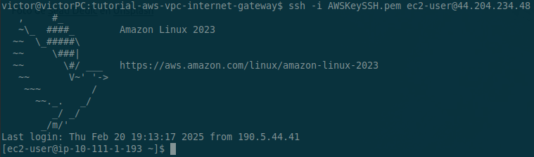

# Overview

This lab will focus on creating a highly available infrastructure by using an Application Load Balancer (ALB) and configuring two target groups to distribute traffic evenly between two EC2 instances. The architecture will include a single ALB, two EC2 instances (with SSH access) in different Availability Zones (AZ), and the association of our ALB with a Route 53 domain

# Set up the Providers

We are going to make use of three providers, AWS, Local and TLS for the generation of our keys. 

```
terraform {
 required_version = "~> 1.10.2"
 required_providers {
   aws = {
     source  = "hashicorp/aws"
     version = "5.83.1"
   }
   local = {
     source  = "hashicorp/local"
     version = "2.5.2"
   }
   tls = {
     source  = "hashicorp/tls"
     version = "4.0.6"
   }
}
}


#Configuring AWS Provider
provider "aws" {
 region = "us-east-1"
}
```

# Create a VPC and Public Subnets

We are going to create a custom VPC and two public subnets in the different Availability Zones to host our infrastructure.

```
#VPC
resource "aws_vpc" "main" {
 cidr_block = "10.111.0.0/16"
}


#Subnet Public
resource "aws_subnet" "public_subnet_a" {
 vpc_id            = aws_vpc.main.id
 cidr_block        = "10.111.1.0/24"
 availability_zone = "us-east-1a"
}


#Subnet Public B
resource "aws_subnet" "public_subnet_b" {
 vpc_id            = aws_vpc.main.id
 cidr_block        = "10.111.2.0/24"
 availability_zone = "us-east-1b"
}
```
# Create an Internet Gateway

Create and place the Internet Gateway which will give our VPC and resources inside access to the internet.

```
#Internet Gateway
resource "aws_internet_gateway" "igw" {
 vpc_id = aws_vpc.main.id
}
```

# Route Tables

We’ll create a route table "public_rtb" for our public subnets. Notice that the traffic for our public subnets goes through the Internet Gateway. We also need to associate the route tables with our public subnets. 

```
#Route Tables
#Public Route table
resource "aws_route_table" "public_rtb" {
 vpc_id = aws_vpc.main.id
 route {
   cidr_block = "0.0.0.0/0"
   gateway_id = aws_internet_gateway.igw.id
 }
}


#Create route table associations
#Associate public Subnet to public route table | for Public Subnet A
resource "aws_route_table_association" "public" {
 subnet_id      = aws_subnet.public_subnet_a.id
 route_table_id = aws_route_table.public_rtb.id
}
#Associate public Subnet to public route table | for Public Subnet B
resource "aws_route_table_association" "public_b" {
 subnet_id      = aws_subnet.public_subnet_b.id
 route_table_id = aws_route_table.public_rtb.id
}
```
# SSH Keys

The configuration below will create a local private key "AWSKeySSH.pem" and a public key "AWSKeySSH" which will be created on the AWS side. We’ll later associate this key pair with our EC2 instances.

```
#SSH Config
#Create PEM File
resource "tls_private_key" "pkey" {
 algorithm = "RSA"
 rsa_bits  = 4096
}


#Private Key - Local
resource "local_file" "private_key_pem" {
 content         = tls_private_key.pkey.private_key_pem
 filename        = "AWSKeySSH.pem"
 file_permission = "0400"
}


#AWS EC2 Key Pair | using tls_private_key to generate public key
resource "aws_key_pair" "ec2_key" {
 key_name   = "AWSKeySSH"
 public_key = tls_private_key.pkey.public_key_openssh


 lifecycle {
   ignore_changes = [key_name] #to ensure it creates a different pair of keys each time
 }
}
```
# Security Groups

Now we need to create two security groups to allow ingress and egress traffic to and from our EC2 instances. We’ll start by creating the security group aws_security_group.web which will allow HTTP/HTTPS/ICMP ingress traffic and a default route to allow all egress traffic. We’ll also create a separate SG aws_security_group.ssh to allow SSH connections to our instances. 
An additional SG (aws_security_group.lb) needs to be created which we will need to attach to our Load Balancer later in this lab. This SG will allow HTTP/HTTPS traffic through our LB. 

```
#Security Group
resource "aws_security_group" "web" {
  name        = "web"
  description = "allow web traffic"
  vpc_id      = aws_vpc.main.id
}
#Ingress rule for Security Group
resource "aws_vpc_security_group_ingress_rule" "allow_443" {
  security_group_id = aws_security_group.web.id
  cidr_ipv4         = "0.0.0.0/0"
  from_port         = 443
  to_port           = 443
  ip_protocol       = "tcp"
}
#Ingress rule for Security Group
resource "aws_vpc_security_group_ingress_rule" "allow_80" {
  security_group_id = aws_security_group.web.id
  cidr_ipv4         = "0.0.0.0/0"
  from_port         = 80
  to_port           = 80
  ip_protocol       = "tcp"
}
#Ingress rule for Security Group
resource "aws_vpc_security_group_ingress_rule" "allow_icmp" {
  security_group_id = aws_security_group.web.id
  cidr_ipv4         = "0.0.0.0/0"
  from_port         = -1
  to_port           = -1
  ip_protocol       = "icmp"
}
#Egress rule for Security Group
resource "aws_vpc_security_group_egress_rule" "egress_all" {
  security_group_id = aws_security_group.web.id
  cidr_ipv4         = "0.0.0.0/0"
  ip_protocol       = "-1"
}

#Security group to allow SSH
resource "aws_security_group" "ssh" {
  name        = "ssh"
  description = "allow SSH (for EC2 instance)"
  vpc_id      = aws_vpc.main.id
}

#Ingress rule for SSH
resource "aws_vpc_security_group_ingress_rule" "allow_ssh" {
  security_group_id = aws_security_group.ssh.id
  cidr_ipv4         = "0.0.0.0/0"
  from_port         = 22
  to_port           = 22
  ip_protocol       = "tcp"
}
#Egress rule for SSH
resource "aws_vpc_security_group_egress_rule" "egress_ssh_all" {
  security_group_id = aws_security_group.ssh.id
  cidr_ipv4         = "0.0.0.0/0"
  ip_protocol       = "-1"
}

#Security Group LB
resource "aws_security_group" "lb" {
  name        = "lb_web"
  description = "allow web traffic"
  vpc_id      = aws_vpc.main.id
}
#ingress rule for Security Group
resource "aws_vpc_security_group_ingress_rule" "lb_allow_443" {
  security_group_id = aws_security_group.lb.id
  cidr_ipv4         = "0.0.0.0/0"
  from_port         = 443
  to_port           = 443
  ip_protocol       = "tcp"
}
#ingress rule for Security Group
resource "aws_vpc_security_group_ingress_rule" "lb_allow_80" {
  security_group_id = aws_security_group.lb.id
  cidr_ipv4         = "0.0.0.0/0"
  from_port         = 80
  to_port           = 80
  ip_protocol       = "tcp"
}
#egress rule for Security Group
resource "aws_vpc_security_group_egress_rule" "lb_egress_all" {
  security_group_id = aws_security_group.lb.id
  cidr_ipv4         = "0.0.0.0/0"
  ip_protocol       = "-1"
}
```

# EC2 Instances

We can now create and place our EC2 instances in the public subnets. We associate them with the security groups aws_security_group.web and aws_security_group.ssh.id, as well as the key pair aws_key_pair.ec2_key.key_name. The User Data includes a small script that installs and configures a basic Apache web server.

# Target Groups

Starting with our Load Balancer configuration, we will create two Target Groups, which, as its name suggests, define the distribution of traffic to the targets. These targets can include EC2 instances, containers, Lambda functions, or IP addresses.

```
#Target Groups
resource "aws_lb_target_group" "tg_a" {
  name     = "tg-a"
  port     = 80
  protocol = "HTTP"
  vpc_id   = aws_vpc.main.id
}

resource "aws_lb_target_group" "tg_b" {
  name     = "tg-b"
  port     = 80
  protocol = "HTTP"
  vpc_id   = aws_vpc.main.id
}
```

# Target Group Attachment

In order for our Target Groups to redirect traffic and need to create a Target Group Attachment for each instance as the respective target.

```
#Target Group Attachment
resource "aws_lb_target_group_attachment" "tg_attach_a" {
  target_group_arn = aws_lb_target_group.tg_a.arn
  target_id        = aws_instance.amazon_linux_lb1.id
  port             = 80
}

resource "aws_lb_target_group_attachment" "tg_attach_b" {
  target_group_arn = aws_lb_target_group.tg_b.arn
  target_id        = aws_instance.amazon_linux_lb2.id
  port             = 80
}
```

# Load Balancer

"We can now create our Load Balancer, attaching the previously created SG and the two subnets where our instances are located."

```
#Load Balancer
resource "aws_lb" "lb" {
  name               = "lb"
  internal           = false
  load_balancer_type = "application"
  security_groups    = [aws_security_group.lb.id]
  subnets            = [aws_subnet.public_subnet_a.id, aws_subnet.public_subnet_b.id]
}
```

# Listener

The last piece of the puzzle is creating the Listener. The Listener is responsible for routing traffic to the Target Groups, in our case, tg_a and tg_b. We need to specify the Load Balancer, port/protocol, SSL policy, Target Groups, and a certificate created through AWS ACM to enable HTTPS. We are using 'weight' to distribute traffic evenly to our targets. Notice that we assign a weight of 100 to each of our Target Groups to achieve this. Alternatively, we could set the weights to 200/100 to send twice as much traffic to one Target Group. More information about Listeners [here](https://docs.aws.amazon.com/elasticloadbalancing/latest/application/load-balancer-listeners.html).  
After applying, make sure to enable the certificate in the AWS Console by creating a record in the Route 53 Public Zone

```
resource "aws_acm_certificate" "api_cert" { 
  domain_name               = "victorponce.site"
  subject_alternative_names = ["victorponce.site"]
  validation_method         = "DNS"
  lifecycle {
    create_before_destroy = true
  }
} 

#Listener
resource "aws_lb_listener" "listner" {
  load_balancer_arn = aws_lb.lb.arn
  port              = 443
  protocol          = "HTTPS"
  ssl_policy        = "ELBSecurityPolicy-2016-08"
  certificate_arn   = aws_acm_certificate.api_cert.arn #certificate for HTTPS
  default_action {
    type = "forward"
    forward {
      target_group {
        arn    = aws_lb_target_group.tg_a.arn
        weight = 100
      }
      target_group {
        arn    = aws_lb_target_group.tg_b.arn
        weight = 100
      }
    }
  }
}
```

# Route 53 Hosted Zone

To be able to follow the next steps, you need to own a domain, which you can purchase through the Route 53 dashboard. Replace the domain in the example for the one you own. 

Created a Route 53 Hosted Zone with for your domain

```
resource "aws_route53_zone" "victor" {
 name = "victorponce.com"
}
```

# Alias Record

You need an Alias Record to associate your domain to your Load Balancer. Pass the DNS name and Zone ID to the record. 

```
# DNS Record = Alias
resource "aws_route53_record" "lb" {
 zone_id = data.aws_route53_zone.victorponce.zone_id #aws_route53_zone.victor.zone_id
 name    = "victorponce.site"
 type    = "A"
 alias {
   name                   = aws_lb.lb.dns_name
   zone_id                = aws_lb.lb.zone_id
   evaluate_target_health = true
 }
}

```

# Testing

Now you can use your domain to access your web server. The Load Balancer configuration we just applied will distribute our requests evenly to each of our instances, so notice that after refreshing the website you will see different host names. 


You might have noticed that after applying, we printed the instances’s public IP on the console (check the outputs.tf file for the details). You can use these IPs and the private key "AWSKeySSH.pem" to connect to the EC2 instances.

You can use you favorite SSH client, and if you are on linux you can use this command:

```
ssh -i AWSKeySSH.pem ec2-user@YOUR-EC2-INSTANCE-IP
```

